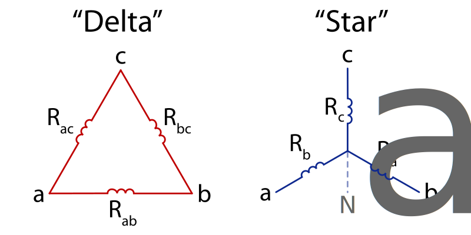
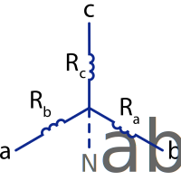
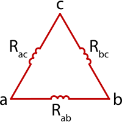

# Phase resistance

The term "phase resistance" may lend itself to some ambiguity, in both meaning and method for measurement. This page attempts to explain how to measure its value, which is required by several of the control algorithms in SimpleFOC.

In this documentation, phase resistance corresponds to the resistance of a single coil inside your motor, measured in Ohms. The line resistance is the resistance between two (non-center) motor leads.

## Identification of 3-phase motors

In the case of 3-phase BLDC motors, you first need to learn whether the motor is wound in a Wye (a.k.a "star") or Delta configuration. Once you know that, it's simple maths to compute the phase resistance from the phase-to-phase measurement.

Additionally, a 3-phase motor may expose 3 or 4 leads, which will affect how phase resistance is measured. In the case of a wye/star motor, the fourth lead corresponds to the center point (a.k.a. "star point"), and will show the least resistance when measured against the other leads.

> Common configurations for 3-phase motors ([source](https://en.wikipedia.org/wiki/File:Delta-Star_Transformation.svg)).

## Procedure

Steps to measure phase resistance for different coil configurations and number of leads. You'll need a multi-meter that can measure resistance and your wits.

### 3-wire Wye/Star

Diagram:

Procedure:

1. Use a multi-meter to measure the resistance across any pair of leads (in Ohms), this is referred to as the "line resistance". All three possible pairs of leads must show the same resistance.
2. **Divide the measurement by two** to obtain the final value for the phase resistance of your motor.

> In Wye/Star configuration, you're measuring two phases at once across each pair, so the measured resistance must be divided by `2`.

### 4-wire Wye/Star

Diagram:

In this case, you'll need to first identify the lead connected to the "center point" (labeled `N_abc` in the diagram above).

Procedure:

1. Use a multi-meter to measure the resistance across all pairs of leads (in Ohms), looking for a lead with exactly half the resistance than the lead pairs that exclude it.
2. The resistance between the lead with the least resistance is connected to the "center point". Label it appropriately.
3. Measure the resistance across the center point you just identified and any of the remaining three leads. This value is the phase resistance of your motor.

> In a 4-wire Wye/Star configuration, the resistance between the center point (4-th lead) and any of the three main leads is the phase resistance, because the measurement does not involve any of the other phases.

### 3-wire Delta

Diagram:

Procedure:

1. Use a multi-meter to measure the resistance across all pairs of leads (in Ohms). All measurements must be equal.
2. **Multiply the measurement by 1.5** to obtain the final value for the phase resistance of your motor.

> In Delta configuration, you measure all phases at once; one of them being in parallel with the remaining two in series. Since all phase resistances are equal, the measurement must be multiplied by `1.5`.
